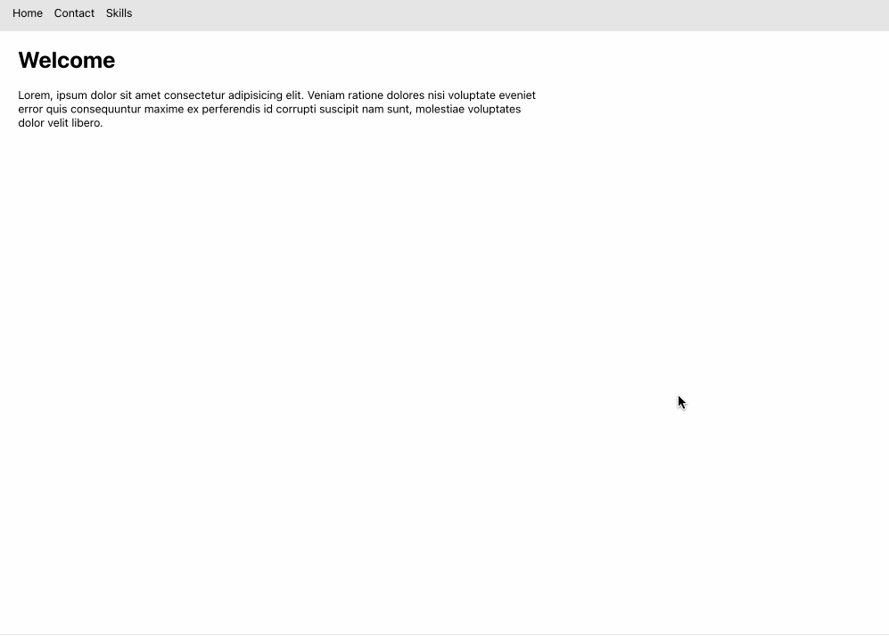

<h1>React Dynamic Routing</h1>
<li>This React project leverages BrowserRouter, Routes, Route, and Link from react-router-dom for client-side routing, creating a smooth single-page application experience.</li>
<li><b>BrowserRouter:</b> Wraps the app, enabling navigation without page reloads.</li>
<li><b>Routes & Route:</b> Define paths and components to render.</li>
<li><b>Link:</b> Provides in-app navigation links, used in Navbar for main pages and within Skills for sub-sections.</li>
<li>Language / tool : HTML, CSS, React</li>
 

